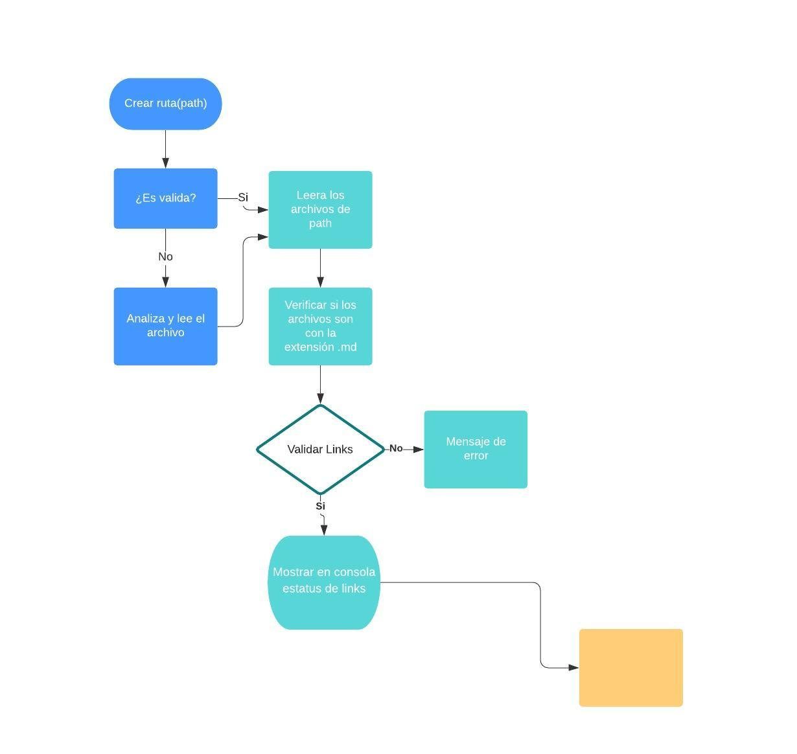
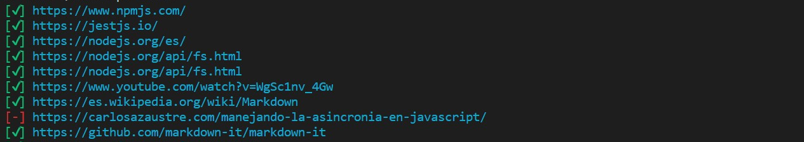

# ¿Qué es MD-Link? 

MD-Link es una librería que facilita la revisión de los links de un archivo con extension .md es decir, archivos tipo Markdown, para así tener conocimientos sobre estos

# Diagrama de flujo 


# Modo de Uso

## Instalación

Para instalar está librería tienes que tener previamente instalado Node.js y npm en tu computador.

Ejecuta la librería desde npm

```
npm i vari-md-links
```

Ejecuta la librería desde GitHub

```
npm install varinea/SCL012-MD-Links-
```

## Utilización de la Librería

```
const  mdLinks = require('md-links');
```
Luego utiliza los argumentos
```
mdLinks(path, options)
```
##  Ejecutar la librería en tu proyecto


```
node <<dirección de tu carpeta del proyecto>>/node_modules/md-links/cli.js <<dirección de tu archivo .md>>
```

##  Ejemplo



